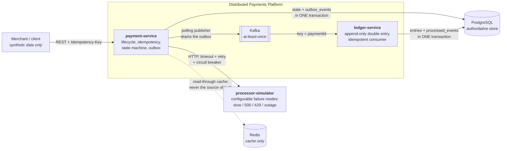
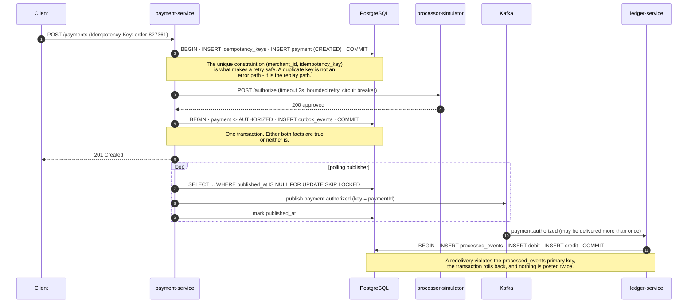

# Distributed Payments Platform

**A payment platform built to survive the things that actually go wrong: duplicate requests, timed-out
dependencies, redelivered messages, and traffic that arrives faster than the database can serve it.**

Java 21 · Spring Boot 3 · PostgreSQL · Kafka · Redis · Kubernetes · Resilience4j · OpenTelemetry · Gatling

> **Status: Phase 1 in progress.**
---

## What problem does this solve?

Taking a payment is easy. Taking it **exactly once** is the hard part, and it stays hard because
every interesting failure happens between two systems rather than inside one:

- the client's HTTP request times out and it retries — did the first attempt charge the card?
- the database commit succeeds and the Kafka publish fails — the payment says `AUTHORIZED` and no
  downstream service will ever hear about it;
- the message broker redelivers an event after a consumer rebalance — the ledger posts twice;
- two support agents click *capture* at the same moment — one payment, two captures;
- the processor gets slow rather than failing, so nothing errors, nothing alerts, and every request
  thread in the service ends up waiting on it.

This project implements a payment lifecycle where each of those has a named, tested answer, and where
you can reproduce the failure yourself in about thirty seconds.

## Architecture

| Service | Responsibility |
|---|---|
| `payment-service` | The only public API. Owns the payment state machine, idempotency, the transactional outbox, and every call to the processor. |
| `processor-simulator` | A fake external processor whose only job is to fail on demand: slow, 500, 429, intermittent, duplicate response, total outage. |
| `ledger-service` | Consumes payment events and posts append-only double-entry ledger lines. Idempotent, because Kafka delivers at least once. |

## Why this architecture?

- **PostgreSQL is authoritative, everything else is derived.** Redis can be down and payments stay
  correct. Kafka can be down and payments stay correct; the events queue up in an outbox table and
  drain when it comes back.
- **Idempotency is enforced by a database unique constraint, not by a cache lookup.** A cache makes
  the check fast; only the constraint makes it *true* under concurrency.
- **The state change and its event are written in one transaction** (transactional outbox), because
  `save(); kafka.send();` is two operations that can half-succeed.
- **Delivery is at-least-once; the business effect is exactly-once.** The broker is allowed to
  redeliver; the consumer records `event_id` in the same transaction as its writes, so a replay posts
  nothing. This project never claims exactly-once delivery, because nothing has it.
- **Money is a `long` of minor currency units plus a currency code.** `12500 INR` is ₹125.00. There
  is no floating point anywhere near an amount.

## Payment flow

## Failure handling

| Failure | What happens                                                                     | Where it is demonstrated |
|---|----------------------------------------------------------------------------------|---|
| Client retries the same request | Same payment returned, no second charge                                          | *Phase 2* |
| Same key, different payload | `422`, never a silent replay of a different amount                               | *Phase 2* |
| Two concurrent captures | One wins on the optimistic-lock version, one is rejected                         | *Phase 2* |
| Processor slow | Client-side timeout bounds the wait; bulkhead stops it consuming every thread    | *Phase 3* |
| Processor returning 500 | Bounded retry with jitter, then the circuit breaker opens and requests fail fast | *Phase 3* |
| Processor times out | Attempt recorded as `UNKNOWN`; reconciliation, never a blind retry               | *Phase 3* |
| Kafka down | Payments still succeed; the outbox drains when the broker returns                | *Phase 4* |
| Duplicate Kafka delivery | `processed_events` makes the second delivery a no-op                             | *Phase 4* |
| Redis down | Correct, just slower, the cache is never the source of truth                     | *Phase 5* |
| Connection pool exhausted | Reproduced deliberately, measured, then fixed                                    | *Phase 8* |

## Consistency model

Within `payment-service`, a payment and its idempotency key and its outbox event are **strongly
consistent** - one PostgreSQL transaction. Across services the model is **eventual consistency**: for
a short window a payment can be `CAPTURED` while the ledger has not posted yet. That is a design
choice, not a defect, and the API is honest about it; the ledger endpoint can legitimately return
"not posted yet". The alternative, a distributed transaction across both services, trades a
significant amount of availability for a guarantee this domain does not need.

## Roadmap and honest status

| Phase | Scope | Status |
|---|---|---|
| 1 | Payment lifecycle, state machine, PostgreSQL, OpenAPI, Docker | **In progress** |
| 2 | Idempotency, unique constraints, optimistic locking, concurrency tests | Not started |
| 3 | Processor simulator, timeouts, retry, circuit breaker, bulkhead (`v0.1`) | Not started |
| 4 | Kafka, transactional outbox, ledger service, idempotent consumers (`v0.2`) | Not started |
| 5 | Redis cache and idempotency acceleration, measured | Not started |
| 6 | OpenTelemetry, Prometheus, Grafana, structured logging | Not started |
| 7 | Kubernetes, Helm, probes, HPA scaling experiments | Not started |
| 8 | Gatling, HikariCP experiment, incident postmortems (`v1.0`) | Not started |

